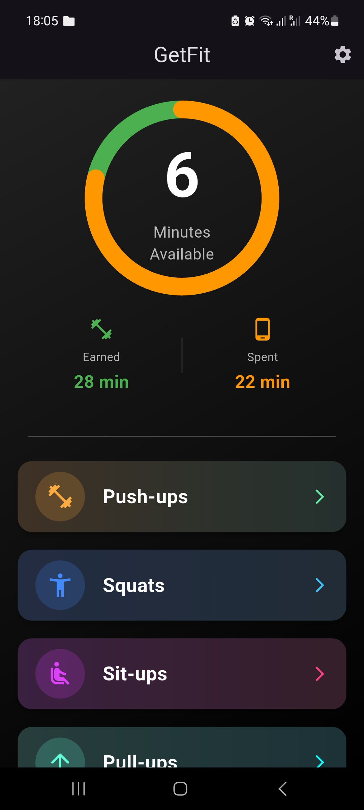

# GetFit - AI-Powered Exercise Tracker

A Flutter prototype that uses AI-powered pose detection to track and count exercise repetitions for multiple exercise types. The earned repetitions can be used to unlock app usage time, promoting fitness and productivity.

## Features

- **Multi-Exercise Support**: Track push-ups, squats, sit-ups (beta), pull-ups, and jumping jacks
- **Real-time Pose Detection**: Uses Google ML Kit for accurate pose tracking
- **KNN Classification**: Machine learning-based exercise classification
- **Adaptive Thresholds**: Calibrate sensitivity for different fitness levels


## Demo

<p align="center">
  
  
  
</p>

## Getting Started

### Prerequisites
- Flutter SDK (3.35.0 or later)
- Android Studio 
- Dart (>=3.9.2 <4.0.0)

### Installation

1. Clone the repository
```bash
git clone https://github.com/BPerju/getfit.git
cd getfit
```

2. Install dependencies
```bash
flutter pub get
```

3. Run the app
```bash
flutter run
```

## Adding New Exercises

1. Define configuration in [models/exercise_config.dart](lib/models/exercise_config.dart)
2. Create classifier in `classifiers/yourexercise_classifier.dart`
3. Update factory in [classifiers/exercise_classifier_factory.dart](lib/classifiers/exercise_classifier_factory.dart)
4. Add CSV asset to [pubspec.yaml](pubspec.yaml)
5. Place training data in `assets/` directory

See [Original Dataset](https://www.kaggle.com/datasets/muhannadtuameh/exercise-recognition/data) for reference.
The features were extracted into csv files using the feature extraction script in `/feature_extraction/`.


## Acknowledgments

- Google ML Kit team for pose detection
- MediaPipe for inspiration on repetition counting


**Note**: This app requires CSV training data for each exercise. The push-up model is included as a reference. You'll need to collect and format training data for the other exercises following the same structure.
